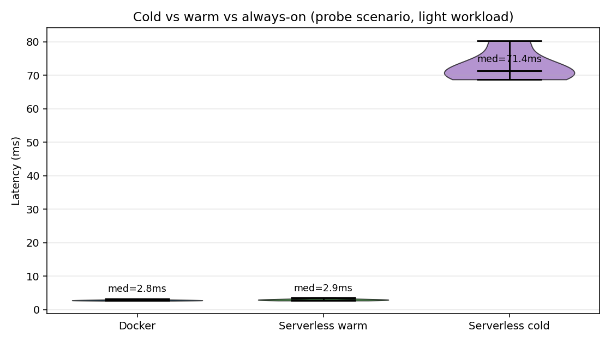

# Docker vs Serverless FaaS — Latency & Resource Benchmark

A reproducible benchmark that runs **byte-identical Python code** under an
always-on (Docker-style) lifecycle and a cold/warm-start (FaaS-style)
lifecycle, then measures where each one wins.

> 📄 **Paper:** *Comparative Analysis of Latency and Resource Utilization in
> Docker and Serverless FaaS Architectures* — **presented at EECSI 2026**
> (IEEE-sponsored, Yogyakarta, 2–3 Sept 2026). First author: Marvino Maruli.



## Key results

| Finding | Number |
|---|---|
| Warm-path latency gap (median, Docker vs warm FaaS) | **0.01–1.30 ms** across light / medium / heavy workloads — inside the noise |
| Cold-start overhead | **~64–82 ms**, roughly constant regardless of workload |
| Relative cost of that overhead | **+2,328%** on a ~3 ms request, **+74%** on an ~86 ms request |
| Idle memory | FaaS releases memory between bursts → **~57% less cumulative memory-time** under sparse traffic |
| Sample | 430 latency observations, 220 CPU/RSS samples (psutil @ 4 Hz), Python 3.13.3, 512 MB cap |

**Takeaway:** cold-start cost belongs to the *workload*, not just the
architecture. Short, latency-sensitive requests on sparse traffic are where
serverless hurts; long requests or bursty/idle traffic are where it wins.

## The hardest part

Making the comparison *fair*. A naive "deploy to Lambda, deploy to a VM,
compare" mixes in network hops, API Gateway, TLS and noisy neighbours, so any
difference could be anything. I isolated the one variable the research
question is about — **process lifecycle** — by loading the same
`core/workload.py` module in both paths, pinning runtime and memory, and
separating cold from warm requests with a probe scenario that injects idle
gaps at a known cadence. That is why the warm-path numbers can be compared
at sub-millisecond resolution.

## What this is *not* (read before citing)

- The published numbers come from the **local, controlled benchmark**: both
  architectures are modelled as process lifecycles on one machine, not measured
  on AWS. Real Lambda cold starts are typically 200–500 ms, so treat 64–82 ms
  as a **lower bound**.
- Only **5 forced cold invocations** in the probe scenario (plus 1 per load
  scenario) — enough to show the overhead, too few to characterise its tail.
- Workloads are CPU-bound with no I/O.
- The Docker and AWS Lambda deployment targets in `docker/` and `serverless/`
  are provided so the experiment *can* be re-run on real infrastructure;
  that run is future work.

## What I'd do differently

1. Run the same scenarios on real AWS Lambda vs ECS/Fargate and report
   cost per million requests alongside latency.
2. Collect 100+ cold starts per workload and report p95/p99 of cold starts,
   not just the median.
3. Add I/O-bound and memory-heavy workloads, where cold starts behave differently.
4. Commit experiment runs incrementally so the history shows how the
   methodology evolved.

---

## Repository layout

    .
    ├── core/                # Shared business logic (identical on both architectures)
    │   └── workload.py
    ├── docker/              # Always-on target
    │   ├── Dockerfile
    │   ├── app.py           # Flask HTTP server wrapping core.workload
    │   ├── docker-compose.yml
    │   └── requirements.txt
    ├── serverless/          # FaaS target
    │   ├── handler.py       # AWS Lambda handler wrapping core.workload
    │   ├── serverless.yml   # Serverless Framework config
    │   └── requirements.txt
    ├── benchmark/
    │   ├── local_simulator.py  # In-process controlled experiment
    │   └── load_test.py        # HTTP load test against deployed endpoints
    ├── analysis/
    │   ├── analyze.py       # Statistics + plot generation
    │   ├── plots/           # Generated figures
    │   └── results_summary.md
    ├── data/
    │   ├── raw/             # Raw per-request CSVs (latency.csv, resources.csv)
    │   └── processed/       # Aggregated CSVs (latency_summary.csv, resource_summary.csv)
    └── docs/
        ├── methodology.md
        └── reproduction_guide.md

The same workload code (`core/workload.py`) is loaded by both wrappers,
so any latency difference observed between the two is attributable to
the architecture, not to the business logic — see Methodology §3.4.

---

## Quick start: reproduce the experiment locally

Requires Python 3.10+. No Docker daemon or AWS account needed.

```bash
pip install -r requirements.txt
python benchmark/local_simulator.py
python analysis/analyze.py
```

Outputs:

- `data/raw/latency.csv` — per-request observed latency
- `data/raw/resources.csv` — CPU% / RSS samples
- `data/processed/latency_summary.csv` and `resource_summary.csv`
- `analysis/plots/*.png` — figures reproduced in the paper
- `analysis/results_summary.md` — markdown summary tables

A full run takes ~3–4 minutes on a laptop and produces ~430 latency
observations across four scenarios for each architecture.

---

## Reproducing against real cloud infrastructure

The local benchmark isolates the architectural variable of interest
(process lifecycle: always-on vs cold-start) on identical hardware. For
researchers who additionally want network and cloud-platform effects
included, both deployment targets are provided.

### Docker target

```bash
cd docker
docker compose up --build -d
# Service is at http://localhost:8080/invoke
python ../benchmark/load_test.py --url http://localhost:8080/invoke --arch docker
```

### Serverless target (AWS Lambda)

```bash
cd serverless
npm install -g serverless
serverless deploy
# Note the endpoint URL printed by `serverless deploy`
python ../benchmark/load_test.py \
    --url https://<your-id>.execute-api.ap-southeast-1.amazonaws.com/invoke \
    --arch serverless
```

Both runs append rows to `data/raw/latency_<arch>_remote.csv` using
exactly the schema that `analysis/analyze.py` consumes.

---

## What the experiment measures

Four scenarios, run independently against each architecture:

| Scenario          | Intensity | Request count | Target rate |
| ----------------- | --------- | ------------- | ----------- |
| cold_warm_probe   | light     | 15            | 1 RPS, with periodic idle injection |
| light_load        | light     | 80            | 20 RPS |
| medium_load       | medium    | 80            | 15 RPS |
| heavy_load        | heavy     | 40            | 8 RPS |

Two metric families are collected:

- **Latency** — wallclock duration from request submission to response,
  with per-stage sub-timings (preprocess / core / postprocess) recorded
  by the workload itself.
- **Resource utilisation** — per-process CPU % and RSS (resident set
  size), sampled at 4 Hz with `psutil`.

The `cold_warm_probe` scenario forces serverless cold starts at a known
cadence so cold vs warm latency can be cleanly separated.

---

## How the local benchmark models each architecture

The two architectures are modelled by their *process lifecycle*, which
is the single property that distinguishes them at the latency layer:

- **Docker (always-on):** one long-lived Python subprocess is spawned
  before the first request, handles every request over stdin/stdout, and
  is shut down only when the scenario ends. No request pays a startup
  cost.
- **Serverless (cold/warm-start):** a fresh `python` interpreter is
  spawned on cold invocations. Interpreter startup + module import is
  included in the measured latency — this is what AWS Lambda's cold-start
  cost actually comprises at the runtime level. A warm subprocess is
  cached for an 8-second window (configurable) to serve subsequent
  requests at warm-start cost.

Both workers execute byte-identical code from `core/workload.py`, so
differences in observed latency or resource usage are attributable to
the lifecycle model, not to the workload.

For a full discussion of validity, see `docs/methodology.md`.

---

## License

Code is released under the MIT License (see `LICENSE`). The raw
experimental data is released under CC BY 4.0.

## Citation

Proceedings are pending; until a DOI is available, please cite as:

```bibtex
@inproceedings{maruli2026dockerfaas,
  title     = {Comparative Analysis of Latency and Resource Utilization in Docker and Serverless FaaS Architectures},
  author    = {Maruli, Marvino and Panjaitan, Moses Alvin Marcello and Gunawan, Alexander Agung Santoso and Pradana, Rilo Chandra},
  booktitle = {International Conference on Electrical Engineering, Computer Science and Informatics (EECSI)},
  year      = {2026},
  note      = {Presented September 2026, Yogyakarta, Indonesia}
}
```
